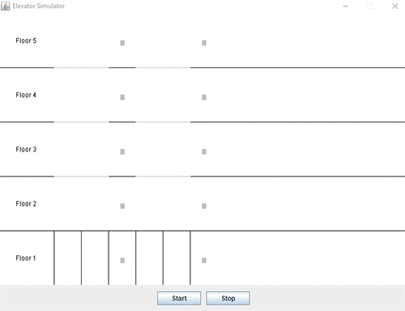

# Elevator Simulator

An elevator simulator with actual animation implemented using Java Swing.

There are only two controls: the start and stop buttons.

**Note: This implementation is rather buggy at the moment.**
